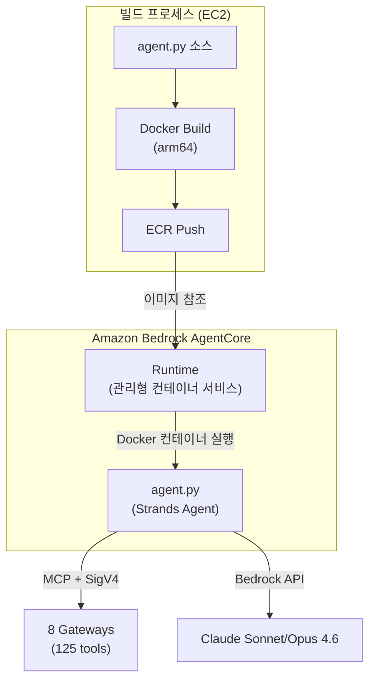
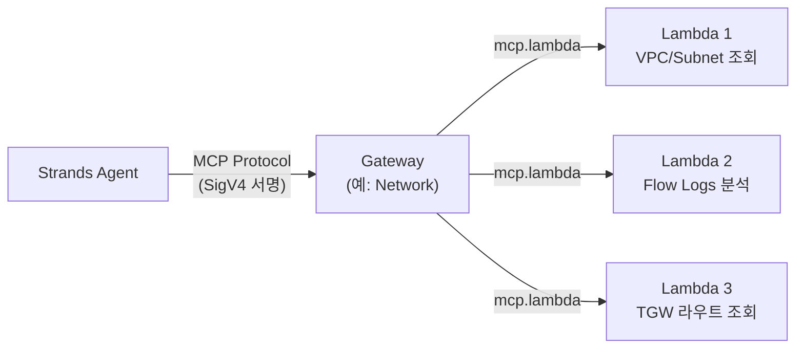
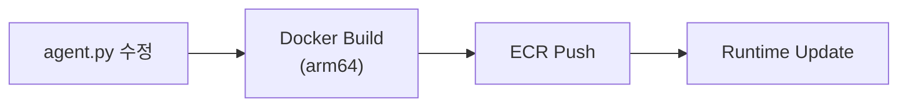
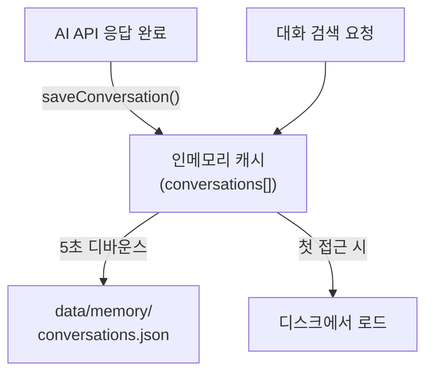
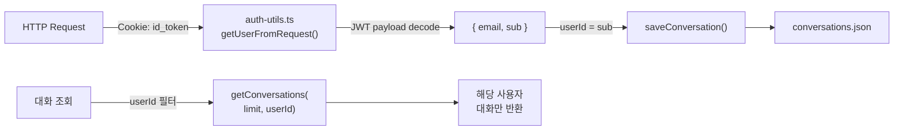
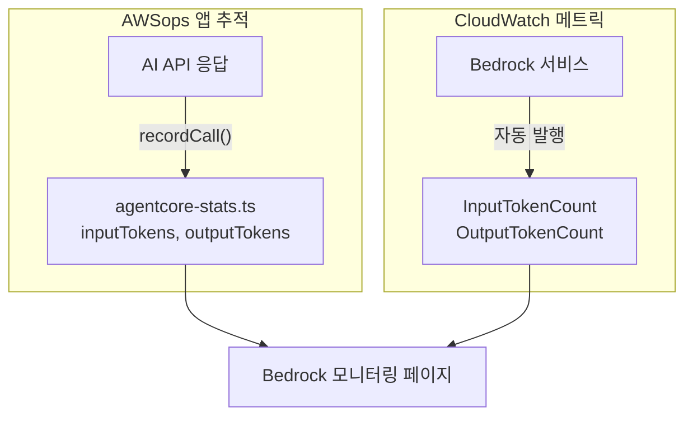
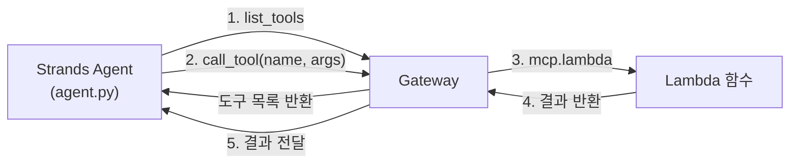
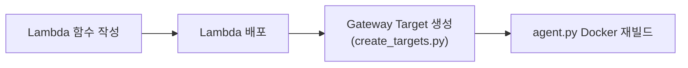
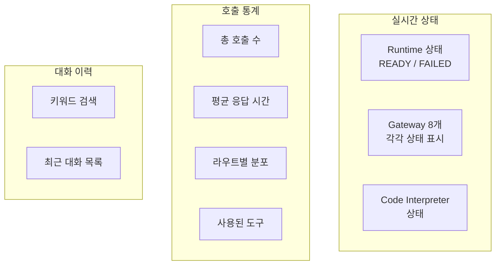

# AgentCore & Memory 기술 FAQ

AgentCore Runtime, Gateway, Memory Store, 통계 추적 등 AI 엔진 내부 동작에 대한 심화 질문과 답변입니다.

<details>
<summary>AgentCore Runtime은 뭔가요? Strands Agent와의 관계는?</summary>

AgentCore Runtime과 Strands Agent는 서로 다른 레이어에서 동작합니다.



### AgentCore Runtime

- AWS가 관리하는 **서버리스 컨테이너 실행 환경**
- Docker 이미지(ECR)를 지정하면 자동으로 컨테이너를 실행/스케일링
- Cold Start 관리, 네트워크 설정, IAM Role 등을 처리
- `InvokeAgentRuntimeCommand`로 호출

### Strands Agent Framework

- **Python 기반 AI 에이전트 프레임워크** (agent.py)
- LLM(Bedrock)에게 도구를 제공하고, 도구 호출 결과를 다시 LLM에 전달하는 루프
- MCP 프로토콜로 Gateway에 연결하여 125개 도구를 사용

### 관계 정리

| 항목 | AgentCore Runtime | Strands Agent |
|------|------------------|---------------|
| 역할 | 컨테이너 실행 환경 | AI 에이전트 로직 |
| 레벨 | 인프라 | 애플리케이션 |
| 관리 주체 | AWS | 개발자 |
| 코드 위치 | AWS 서비스 | `agent/agent.py` |
| 설정 | CDK/CLI | Python 코드 |

</details>

<details>
<summary>Gateway와 Lambda는 어떤 관계인가요?</summary>

Gateway는 **MCP 프로토콜 라우터**이고, Lambda는 **실제 AWS API를 실행하는 백엔드**입니다.



### Gateway (8개)

- Agent가 `list_tools`로 사용 가능한 도구 목록을 조회
- Agent가 도구를 선택하면 Gateway가 해당 Lambda를 호출
- **MCP(Model Context Protocol)** 표준을 사용
- Gateway Target 생성 시 `mcp.lambda` 프로토콜과 `credentialProviderConfigurations` 지정

### Lambda (19개)

- 각 Lambda는 특정 AWS API를 실행하는 함수들을 포함
- 예: Network Lambda는 `describe_vpcs`, `describe_flow_logs` 등 AWS SDK 호출
- `agent/lambda/*.py`에 소스 코드
- `agent/lambda/create_targets.py`로 Gateway Target 일괄 생성

### 왜 Lambda를 사용하나요?

| 이유 | 설명 |
|------|------|
| **격리** | 각 도구가 독립 실행, 하나가 실패해도 다른 도구에 영향 없음 |
| **권한 분리** | Lambda별로 최소 권한 IAM Role 부여 가능 |
| **스케일링** | 동시 호출 시 자동 스케일링 |
| **비용** | 호출 시에만 과금, 유휴 비용 없음 |

:::caution Gateway Target 생성 시 주의
CLI의 `--inline-payload` 옵션은 JSON 파싱 이슈가 있습니다. **Python/boto3**로 생성해야 합니다.
:::

</details>

<details>
<summary>Docker arm64 빌드가 필수인 이유는?</summary>

AgentCore Runtime은 **AWS Graviton(ARM64)** 프로세서에서 실행됩니다.

```bash
# 올바른 빌드 명령
docker buildx build --platform linux/arm64 --load -t awsops-agent .

# ECR 푸시
docker tag awsops-agent:latest $ECR_URI:latest
docker push $ECR_URI:latest
```

### x86(amd64)로 빌드하면?

컨테이너가 시작되지 않거나 `exec format error`가 발생합니다. Runtime 상태가 `FAILED`로 전환됩니다.

### Apple Silicon Mac에서 개발 시

Apple Silicon(M1/M2/M3)은 네이티브 ARM64이므로 `--platform` 없이도 arm64로 빌드됩니다. 단, **Intel Mac**에서는 반드시 `--platform linux/arm64`를 명시해야 합니다.

### EC2 빌드 환경

AWSops는 `t4g.2xlarge`(Graviton) 인스턴스를 사용하므로, EC2에서 빌드하면 네이티브 arm64 빌드가 됩니다.

</details>

<details>
<summary>agent.py를 수정하면 어떻게 재배포하나요?</summary>

agent.py 수정 후 배포는 3단계입니다.



### Step 1: Docker 빌드 및 ECR 푸시

```bash
cd agent
docker buildx build --platform linux/arm64 --load -t awsops-agent .
docker tag awsops-agent:latest $ECR_URI:latest
docker push $ECR_URI:latest
```

### Step 2: Runtime 업데이트

```bash
aws bedrock-agentcore update-agent-runtime \
  --agent-runtime-id $RUNTIME_ID \
  --role-arn $ROLE_ARN \
  --network-configuration "$NETWORK_CONFIG"
```

:::warning 필수 파라미터
`update-agent-runtime`은 `--role-arn`과 `--network-configuration`을 **반드시** 함께 전달해야 합니다. 생략하면 기존 설정이 초기화될 수 있습니다.
:::

### Step 3: 확인

```bash
aws bedrock-agentcore get-agent-runtime \
  --agent-runtime-id $RUNTIME_ID \
  --query 'status'
# "READY"가 되면 배포 완료
```

### Gateway URL 변경 시

`agent.py`의 `GATEWAYS` 딕셔너리에 계정별 Gateway URL이 있습니다. 새 계정에 배포할 때는 이 URL을 업데이트한 후 Docker 재빌드가 필요합니다.

</details>

<details>
<summary>Memory Store는 어떻게 동작하나요?</summary>

AWSops의 Memory Store는 **인메모리 캐시 + 디바운스 디스크 플러시** 패턴을 사용합니다.



### 저장 구조

```typescript
// src/lib/agentcore-memory.ts
interface ConversationRecord {
  id: string;           // 고유 ID
  userId: string;       // Cognito sub (사용자 식별)
  timestamp: string;    // ISO 8601
  route: string;        // 라우트 (network, cost 등)
  gateway: string;      // 게이트웨이 이름
  question: string;     // 사용자 질문
  summary: string;      // AI 응답 요약
  usedTools: string[];  // 사용된 도구 목록
  responseTimeMs: number; // 응답 시간
  via: string;          // 처리 경로
}
```

### 동작 방식

| 항목 | 설명 |
|------|------|
| **최대 보관** | 100건 (초과 시 오래된 것부터 삭제) |
| **캐시** | 인메모리 — 디스크 읽기 최소화 |
| **플러시** | 5초 디바운스 — 빈번한 저장 시 마지막 1회만 디스크 기록 |
| **파일 위치** | `data/memory/conversations.json` |
| **검색** | 질문, 요약, 라우트, 도구명으로 키워드 검색 |

### 왜 데이터베이스가 아닌 파일?

- 추가 인프라 불필요 (EC2 내 파일 시스템)
- 100건 수준의 데이터에 DB는 과도
- 인메모리 캐시로 조회 성능 충분
- JSON 파일이므로 백업/이동 간편

### AgentCore Memory Store와의 차이

`data/config.json`의 `memoryId`는 **AgentCore 서비스의 Memory Store**입니다. 이것은 agent.py 내부에서 Strands Agent가 사용하는 장기 메모리이고, `agentcore-memory.ts`는 **AWSops 대시보드 UI**에서 대화 이력을 표시하기 위한 별도 저장소입니다.

</details>

<details>
<summary>대화 이력이 사용자별로 분리되는 원리는?</summary>

Cognito JWT에서 사용자 ID를 추출하여 각 대화에 태그합니다.



### 인증 흐름

1. **Lambda@Edge**가 CloudFront에서 JWT를 검증 (서명, 만료 확인)
2. 검증 통과한 요청이 EC2에 도달
3. `auth-utils.ts`의 `getUserFromRequest()`가 JWT payload를 **디코딩만** 수행 (서명 재검증 불필요)
4. `sub` (Cognito User Pool 고유 ID)를 사용자 식별자로 사용

### 저장 시

```typescript
// src/app/api/ai/route.ts
const user = getUserFromRequest(request);
await saveConversation({
  id: crypto.randomUUID(),
  userId: user?.sub || 'anonymous',
  // ... 나머지 필드
});
```

### 조회 시

```typescript
// 사용자별 필터링
const conversations = await getConversations(20, user?.sub);
// → userId가 일치하는 대화만 반환
```

### 인증 미설정 환경

Cognito가 설정되지 않은 환경에서는 `userId`가 `'anonymous'`로 저장되어 모든 사용자의 대화가 통합됩니다.

</details>

<details>
<summary>AgentCore 호출 통계는 어떻게 추적되나요?</summary>

`agentcore-stats.ts`가 모든 AI 호출을 인메모리로 집계하고 디스크에 영구 저장합니다.

### 추적 항목

```typescript
// src/lib/agentcore-stats.ts
interface AgentCoreCallRecord {
  timestamp: string;
  route: string;        // 라우트 (network, cost 등)
  gateway: string;      // 게이트웨이
  responseTimeMs: number;
  usedTools: string[];  // 사용된 도구
  success: boolean;
  via: string;          // 처리 경로
  inputTokens?: number;  // 입력 토큰
  outputTokens?: number; // 출력 토큰
  model?: string;        // 사용 모델
}
```

### 집계 통계

| 통계 | 설명 |
|------|------|
| `totalCalls` | 전체 호출 수 |
| `successCalls` / `failedCalls` | 성공/실패 횟수 |
| `avgResponseTimeMs` | **이동 평균** 응답 시간 |
| `callsByGateway` | 게이트웨이별 호출 수 |
| `callsByRoute` | 라우트별 호출 수 |
| `uniqueToolsUsed` | 사용된 고유 도구 목록 (최대 200개) |
| `tokensByModel` | 모델별 입력/출력 토큰 및 호출 수 |
| `recentCalls` | 최근 50건 상세 기록 |

### 성능 최적화

Memory Store와 동일한 **인메모리 캐시 + 5초 디바운스 flush** 패턴:

```
recordCall() → 인메모리 업데이트 → 5초 대기 → 디스크 기록
recordCall() → 인메모리 업데이트 → 타이머 리셋 → 5초 대기 → 디스크 기록
```

연속 호출 시 마지막 1회만 디스크에 기록하므로 I/O 부하가 최소화됩니다.

### UI에서 확인

AgentCore 대시보드 페이지(`/awsops/agentcore`)에서 실시간 통계를 확인할 수 있습니다.

</details>

<details>
<summary>토큰 사용량과 비용은 어떻게 모니터링하나요?</summary>

AWSops는 **2가지 소스**에서 토큰 사용량을 추적합니다.



### 1. AWSops 앱 내부 추적

AI API(`/api/ai`)에서 Bedrock 응답의 `usage` 필드를 파싱하여 `recordCall()`에 전달:

```typescript
recordCall({
  inputTokens: usage.inputTokens,
  outputTokens: usage.outputTokens,
  model: 'sonnet-4.6',
  // ...
});
```

모델별로 집계되어 `tokensByModel`에 저장됩니다.

### 2. CloudWatch 메트릭

Bedrock 서비스가 자동으로 발행하는 메트릭:
- `InputTokenCount`, `OutputTokenCount`
- `InvocationCount`, `InvocationLatency`
- 모델 ID별, 리전별 필터링 가능

### Bedrock 모니터링 페이지

`/awsops/bedrock` 페이지에서 두 소스를 비교 표시합니다:

| 항목 | Account 전체 (CloudWatch) | AWSops 앱만 (내부 추적) |
|------|--------------------------|----------------------|
| 소스 | CloudWatch `AWS/Bedrock` | `agentcore-stats.ts` |
| 범위 | 계정 내 모든 Bedrock 호출 | AWSops 대시보드 호출만 |
| 용도 | 전체 비용 파악 | 대시보드 기여분 파악 |

:::tip 비용 추정
Bedrock 토큰 비용 = (입력 토큰 × 입력 단가) + (출력 토큰 × 출력 단가). Sonnet 4.6 기준 입력 $3/MTok, 출력 $15/MTok입니다.
:::

</details>

<details>
<summary>Code Interpreter나 Memory 이름에 하이픈을 쓰면 안 되는 이유는?</summary>

AgentCore API의 **네이밍 규칙 제약** 때문입니다.

### 영향받는 리소스

| 리소스 | 잘못된 예 | 올바른 예 |
|--------|----------|----------|
| Code Interpreter | `awsops-code-interpreter` | `awsops_code_interpreter` |
| Memory Store | `awsops-memory` | `awsops_memory` |

### 증상

하이픈이 포함된 이름으로 생성 시:
- `ValidationException` 또는 생성은 되지만 호출 시 실패
- 에러 메시지가 불명확할 수 있음

### config.json 설정

```json
{
  "codeInterpreterName": "awsops_code_interpreter-XXXXX",
  "memoryId": "awsops_memory-XXXXX",
  "memoryName": "awsops_memory"
}
```

`codeInterpreterName`과 `memoryId`의 `-XXXXX` 부분은 AWS가 자동 생성한 **suffix**입니다. 사용자가 지정하는 이름 부분(`awsops_code_interpreter`, `awsops_memory`)에만 제약이 적용됩니다.

### Memory Store 추가 제약

- `eventExpiryDuration`: 최대 365일
- 만료된 이벤트는 자동 삭제

</details>

<details>
<summary>config.json만 바꾸면 다른 계정에 배포 가능한 이유는?</summary>

AWSops는 **계정 의존적 값을 코드에 하드코딩하지 않고** `data/config.json`에서 런타임에 로드합니다.

### config.json 구조

```json
{
  "costEnabled": true,
  "agentRuntimeArn": "arn:aws:bedrock-agentcore:ap-northeast-2:123456789012:runtime/RT_ID",
  "codeInterpreterName": "awsops_code_interpreter-XXXXX",
  "memoryId": "awsops_memory-XXXXX",
  "memoryName": "awsops_memory"
}
```

### 로드 방식

```typescript
// src/lib/app-config.ts
export function getConfig(): AppConfig {
  // data/config.json을 읽어서 반환
  // 파일이 없으면 기본값 사용
}

// src/app/api/ai/route.ts — 사용 예
function getAgentRuntimeArn(): string {
  const config = getConfig();
  return config.agentRuntimeArn || '';
}
```

### 계정별 배포 절차

1. 새 계정에서 배포 스크립트(Step 0~7) 실행
2. 생성된 ARN, 이름을 `data/config.json`에 기록
3. 코드 수정 없이 바로 사용 가능

### 계정별로 달라지는 값

| 항목 | 설명 |
|------|------|
| `agentRuntimeArn` | AgentCore Runtime ARN (계정+리전+ID) |
| `codeInterpreterName` | Code Interpreter 이름 (계정별 고유) |
| `memoryId` | Memory Store ID (계정별 고유) |
| `costEnabled` | Cost Explorer 사용 가능 여부 (MSP는 false) |

### agent.py Gateway URL

`agent.py` 내부의 Gateway URL도 계정별로 다릅니다. 이 부분은 config.json이 아닌 Docker 이미지에 포함되므로, **새 계정 배포 시 Docker 재빌드가 필요**합니다.

</details>

<details>
<summary>MCP 프로토콜이란? 도구 디스커버리는 어떻게 동작하나요?</summary>

### MCP (Model Context Protocol)

MCP는 AI 에이전트가 외부 도구를 **표준화된 방식으로 호출**하기 위한 프로토콜입니다. AWSops에서는 Strands Agent가 MCP를 통해 Gateway의 125개 도구에 접근합니다.



### SigV4 서명 통신

Gateway 연결은 AWS SigV4 서명이 필요합니다:

```python
# agent/agent.py
def create_gateway_transport(gateway_url):
    """SigV4 서명된 HTTP 전송 생성"""
    access_key, secret_key, session_token = get_aws_credentials()
    credentials = Credentials(access_key, secret_key, session_token)
    return streamablehttp_client_with_sigv4(
        url=gateway_url,
        credentials=credentials,
        service="bedrock-agentcore",
        region=GATEWAY_REGION,
    )
```

### 도구 디스커버리 (Tool Discovery)

Agent가 Gateway에 연결하면 **페이지네이션**으로 전체 도구 목록을 조회합니다:

```python
# agent/agent.py
def get_all_tools(client):
    """MCP 클라이언트에서 페이지네이션으로 모든 도구 조회"""
    tools = []
    more = True
    token = None
    while more:
        batch = client.list_tools_sync(pagination_token=token)
        tools.extend(batch)
        if batch.pagination_token is None:
            more = False
        else:
            token = batch.pagination_token
    return tools
```

### 도구 실행 흐름

```python
# Gateway 연결 → 도구 조회 → Agent 실행
mcp_client = MCPClient(lambda: create_gateway_transport(gateway_url))
with mcp_client:
    tools = get_all_tools(mcp_client)           # 도구 목록 조회
    agent = Agent(model=model, tools=tools)      # LLM에 도구 제공
    response = agent(user_input)                 # LLM이 도구 선택/실행
```

LLM(Bedrock)이 사용자 질문을 보고 **어떤 도구를 호출할지 스스로 결정**합니다. 개발자가 도구 선택 로직을 작성할 필요가 없습니다.

</details>

<details>
<summary>Gateway에 새 도구(Lambda)를 추가하려면?</summary>

### 전체 흐름



### Step 1: Lambda 함수 작성

`agent/lambda/` 디렉토리에 새 Python 파일을 생성합니다:

```python
# agent/lambda/my_new_mcp.py
import json
import boto3

def lambda_handler(event, context):
    params = event if isinstance(event, dict) else json.loads(event)
    t = params.get("tool_name", "")
    args = params.get("arguments", params)

    if t == "my_new_tool":
        client = boto3.client('ec2')
        result = client.describe_instances(**args)
        return {"statusCode": 200, "body": json.dumps(result, default=str)}

    return {"statusCode": 400, "body": "Unknown tool"}
```

### Step 2: Gateway Target 생성

`agent/lambda/create_targets.py`에 도구 스키마를 추가합니다:

```python
# 도구 스키마 형식
tools = [{
    "name": "my_new_tool",
    "description": "새 도구 설명",
    "inputSchema": {
        "type": "object",
        "properties": {
            "param1": {"type": "string", "description": "파라미터 설명"},
        },
        "required": ["param1"]
    }
}]

# Gateway Target 생성
create_target(
    gw_id=find_gateway('ops'),     # 대상 Gateway
    name='my-new-target',
    fn='awsops-my-new-mcp',        # Lambda 함수 이름
    desc='My new tool description',
    tools=tools
)
```

핵심 설정:

```python
# create_targets.py 내부
client.create_gateway_target(
    gatewayIdentifier=gw_id,
    targetConfiguration={
        'mcp': {'lambda': {
            'lambdaArn': arn,
            'toolSchema': {'inlinePayload': tools}  # 도구 스키마
        }}
    },
    credentialProviderConfigurations=[
        {'credentialProviderType': 'GATEWAY_IAM_ROLE'}  # 필수
    ]
)
```

### Step 3: Docker 재빌드

새 도구가 추가되면 Agent가 `list_tools`로 자동 발견합니다. Docker 재빌드는 agent.py 자체를 수정한 경우에만 필요합니다.

:::tip 크로스 어카운트 지원
`create_targets.py`가 모든 도구에 자동으로 `target_account_id` 파라미터를 주입합니다. Lambda에서 `cross_account.py`의 `get_client()`를 사용하면 STS AssumeRole로 다른 계정의 리소스에 접근할 수 있습니다.
:::

</details>

<details>
<summary>Lambda 도구 함수는 어떤 구조인가요?</summary>

### Lambda 구조 패턴

모든 19개 Lambda 함수는 동일한 MCP 핸들러 패턴을 따릅니다:

```python
# 공통 패턴 (예: agent/lambda/aws_cost_mcp.py)
def lambda_handler(event, context):
    # 1. 이벤트 파싱 + 도구 라우팅
    params = event if isinstance(event, dict) else json.loads(event)
    t = params.get("tool_name", "")
    args = params.get("arguments", params)

    # 2. 크로스 어카운트 지원
    target_account_id = args.pop('target_account_id', None)
    role_arn = get_role_arn(target_account_id) if target_account_id else None

    # 3. 도구별 분기
    if t == "get_cost_and_usage":
        ce = get_client('ce', 'us-east-1', role_arn)
        resp = ce.get_cost_and_usage(...)
        return ok(resp)
    elif t == "get_cost_forecast":
        ...
    else:
        return err("Unknown tool")
```

### 19개 Lambda 구성

| Lambda 파일 | Gateway | 도구 수 | 설명 |
|------------|---------|--------|------|
| `network_mcp.py` | Network | 15 | VPC, TGW, VPN, ENI, Firewall |
| `reachability.py` | Network | 1 | Reachability Analyzer |
| `flowmonitor.py` | Network | 1 | VPC Flow Logs |
| `aws_eks_mcp.py` | Container | 9 | EKS, CloudWatch, IAM |
| `aws_ecs_mcp.py` | Container | 3 | ECS 클러스터/서비스/태스크 |
| `aws_istio_mcp.py` | Container | 12 | Istio CRD (VPC Lambda) |
| `aws_iac_mcp.py` | IaC | 7 | CloudFormation, CDK |
| `aws_terraform_mcp.py` | IaC | 5 | Terraform Provider/Module |
| `aws_dynamodb_mcp.py` | Data | 6 | DynamoDB |
| `aws_rds_mcp.py` | Data | 6 | RDS/Aurora |
| `aws_valkey_mcp.py` | Data | 6 | ElastiCache |
| `aws_msk_mcp.py` | Data | 6 | MSK Kafka |
| `aws_iam_mcp.py` | Security | 14 | IAM |
| `aws_cloudwatch_mcp.py` | Monitoring | 11 | CloudWatch |
| `aws_cloudtrail_mcp.py` | Monitoring | 5 | CloudTrail |
| `aws_cost_mcp.py` | Cost | 9 | Cost Explorer |
| `aws_knowledge.py` | Ops | 5 | AWS 문서 |
| `aws_core_mcp.py` | Ops | 3 | CLI, 프롬프트 |
| VPC Lambda | Ops | 1 | Steampipe SQL |

### 공유 모듈: `cross_account.py`

크로스 어카운트 접근을 위한 STS AssumeRole 헬퍼:

```python
# 크로스 어카운트 클라이언트 생성
client = get_client('ec2', 'ap-northeast-2', role_arn)
# → STS AssumeRole → 임시 자격 증명으로 boto3 클라이언트 생성
# → 자격 증명 50분 캐싱으로 반복 호출 최적화
```

### 규칙

- 모든 Lambda는 **읽기 전용** (Reachability 경로 생성 제외)
- VPC Lambda(Istio, Steampipe)는 `psycopg2` 대신 `pg8000` 사용
- 도구 스키마 형식: `{name, description, inputSchema: {type, properties, required}}`

</details>

<details>
<summary>AgentCore Runtime 상태는 어떻게 모니터링하나요?</summary>

### 상태 조회 API

`/api/agentcore` API가 Runtime, Gateway, Code Interpreter 상태를 조회합니다:

```typescript
// src/app/api/agentcore/route.ts
const [runtimeRaw, gatewaysRaw] = await Promise.all([
  awsCli(['bedrock-agentcore-control', 'get-agent-runtime',
          '--agent-runtime-id', getRuntimeId()]),
  awsCli(['bedrock-agentcore-control', 'list-gateways']),
]);
```

### Runtime 상태

| 상태 | 의미 | 조치 |
|------|------|------|
| **READY** | 정상 작동 | - |
| **CREATING** | 최초 생성 중 | 수 분 대기 |
| **UPDATING** | 업데이트 중 (Docker 이미지 변경 등) | 수 분 대기 |
| **FAILED** | 오류 — 컨테이너 시작 실패 | Docker 이미지/IAM Role/네트워크 확인 |

### 대시보드 UI

AgentCore 페이지(`/awsops/agentcore`)에서 확인 가능한 정보:



### 상태 캐싱

상태 조회 결과는 **5분간 캐시**됩니다. 새로고침 버튼으로 즉시 갱신할 수 있습니다:

```typescript
const cache = new NodeCache({ stdTTL: 300, checkperiod: 60 });
```

</details>
