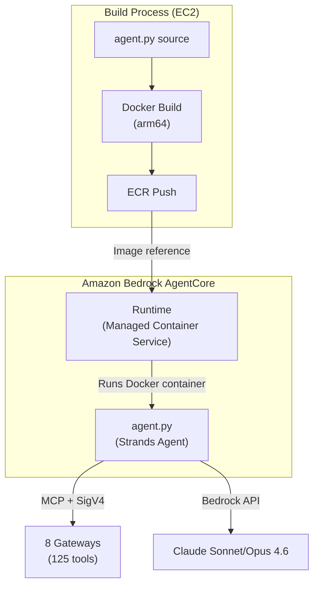
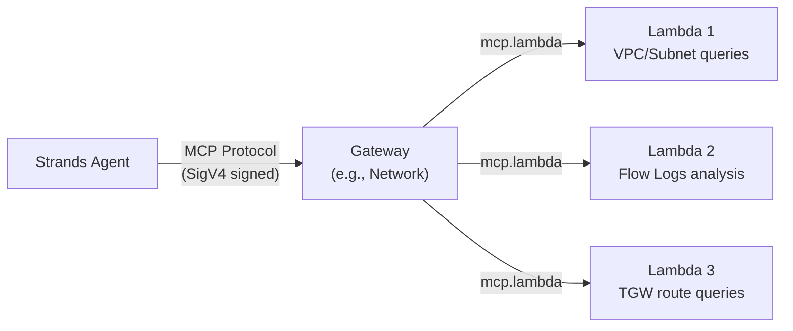
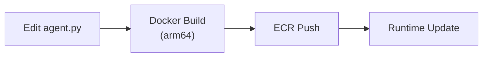
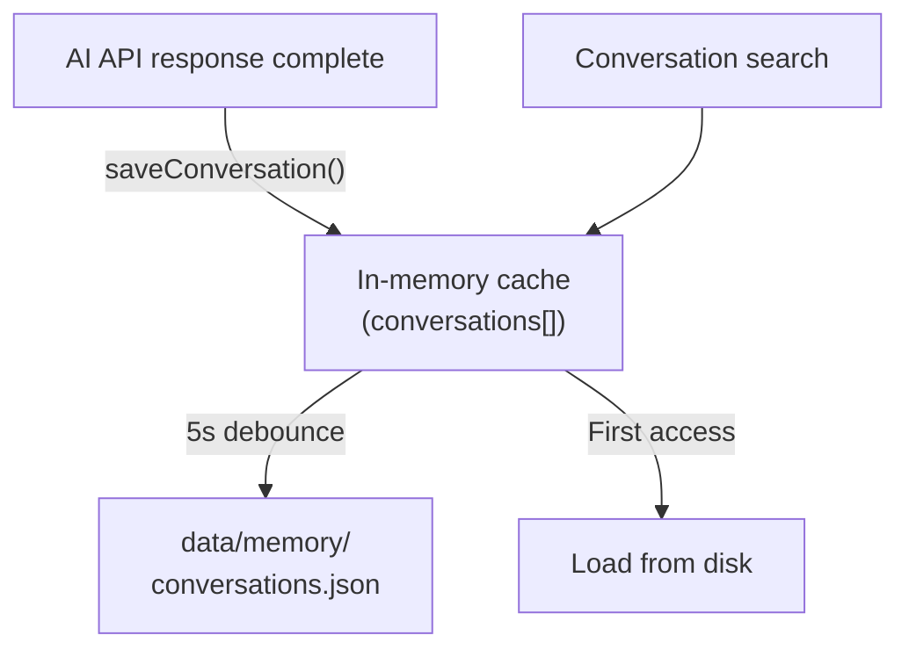
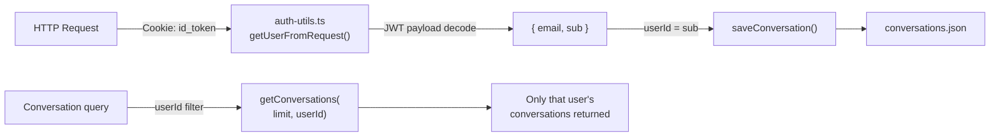
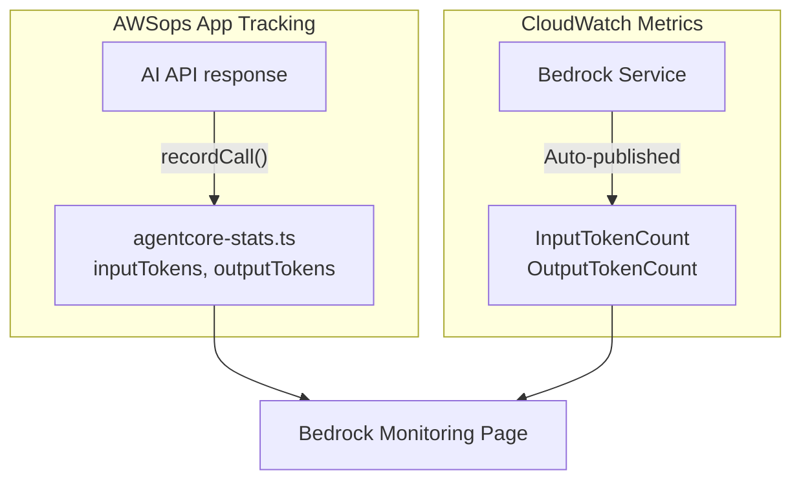
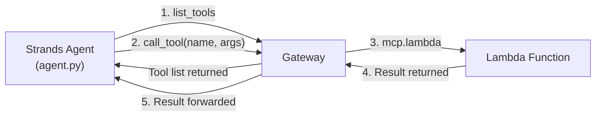
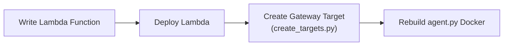
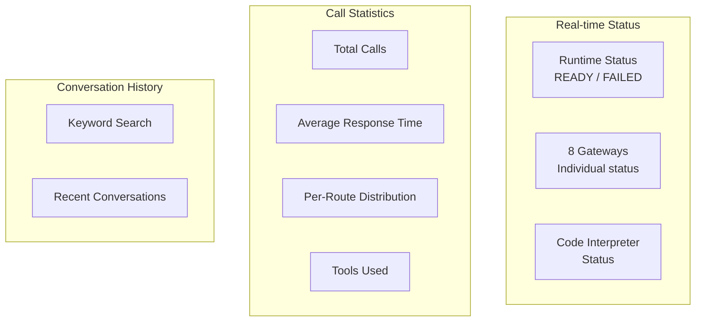

# AgentCore & Memory Technical FAQ

In-depth questions and answers about the AI engine internals: AgentCore Runtime, Gateway, Memory Store, and stats tracking.

<details>
<summary>What is AgentCore Runtime? How does it relate to Strands Agent?</summary>

AgentCore Runtime and Strands Agent operate at different layers.



### AgentCore Runtime

- AWS-managed **serverless container execution environment**
- Specify a Docker image (ECR) and it automatically runs/scales containers
- Handles Cold Start management, network configuration, IAM Roles
- Invoked via `InvokeAgentRuntimeCommand`

### Strands Agent Framework

- **Python-based AI agent framework** (agent.py)
- Provides tools to the LLM (Bedrock) and feeds tool results back in a loop
- Connects to Gateways via MCP protocol to access 125 tools

### Relationship Summary

| Item | AgentCore Runtime | Strands Agent |
|------|------------------|---------------|
| Role | Container execution environment | AI agent logic |
| Level | Infrastructure | Application |
| Managed by | AWS | Developer |
| Code location | AWS service | `agent/agent.py` |
| Configuration | CDK/CLI | Python code |

</details>

<details>
<summary>What is the relationship between Gateway and Lambda?</summary>

Gateway is the **MCP protocol router**, and Lambda is the **backend that executes actual AWS APIs**.



### Gateways (8)

- Agent calls `list_tools` to discover available tools
- When Agent selects a tool, Gateway invokes the corresponding Lambda
- Uses **MCP (Model Context Protocol)** standard
- Gateway Targets are created with `mcp.lambda` protocol and `credentialProviderConfigurations`

### Lambda Functions (19)

- Each Lambda contains functions that execute specific AWS APIs
- Example: Network Lambda calls `describe_vpcs`, `describe_flow_logs`, etc.
- Source code in `agent/lambda/*.py`
- `agent/lambda/create_targets.py` for batch Gateway Target creation

### Why Lambda?

| Reason | Description |
|--------|-------------|
| **Isolation** | Each tool runs independently; one failure doesn't affect others |
| **Permission separation** | Least-privilege IAM Role per Lambda |
| **Scaling** | Auto-scales on concurrent invocations |
| **Cost** | Pay only on invocation, no idle cost |

:::caution Gateway Target Creation
The CLI `--inline-payload` option has JSON parsing issues. Use **Python/boto3** instead.
:::

</details>

<details>
<summary>Why is Docker arm64 build required?</summary>

AgentCore Runtime runs on **AWS Graviton (ARM64)** processors.

```bash
# Correct build command
docker buildx build --platform linux/arm64 --load -t awsops-agent .

# ECR push
docker tag awsops-agent:latest $ECR_URI:latest
docker push $ECR_URI:latest
```

### What happens with x86 (amd64) build?

The container won't start or will fail with `exec format error`. Runtime status transitions to `FAILED`.

### Developing on Apple Silicon Mac

Apple Silicon (M1/M2/M3) is native ARM64, so it builds arm64 without `--platform`. However, **Intel Macs** must specify `--platform linux/arm64`.

### EC2 Build Environment

AWSops uses `t4g.2xlarge` (Graviton) instances, so builds on EC2 are natively arm64.

</details>

<details>
<summary>How do I redeploy after modifying agent.py?</summary>

Deployment after modifying agent.py has 3 steps.



### Step 1: Docker build and ECR push

```bash
cd agent
docker buildx build --platform linux/arm64 --load -t awsops-agent .
docker tag awsops-agent:latest $ECR_URI:latest
docker push $ECR_URI:latest
```

### Step 2: Runtime update

```bash
aws bedrock-agentcore update-agent-runtime \
  --agent-runtime-id $RUNTIME_ID \
  --role-arn $ROLE_ARN \
  --network-configuration "$NETWORK_CONFIG"
```

:::warning Required parameters
`update-agent-runtime` **must** include both `--role-arn` and `--network-configuration`. Omitting them may reset existing settings.
:::

### Step 3: Verify

```bash
aws bedrock-agentcore get-agent-runtime \
  --agent-runtime-id $RUNTIME_ID \
  --query 'status'
# "READY" means deployment is complete
```

### When Gateway URLs change

`agent.py` contains a `GATEWAYS` dictionary with per-account Gateway URLs. When deploying to a new account, update these URLs and rebuild Docker.

</details>

<details>
<summary>How does the Memory Store work?</summary>

AWSops Memory Store uses an **in-memory cache + debounced disk flush** pattern.



### Storage Structure

```typescript
// src/lib/agentcore-memory.ts
interface ConversationRecord {
  id: string;           // Unique ID
  userId: string;       // Cognito sub (user identifier)
  timestamp: string;    // ISO 8601
  route: string;        // Route (network, cost, etc.)
  gateway: string;      // Gateway name
  question: string;     // User question
  summary: string;      // AI response summary
  usedTools: string[];  // Tools used
  responseTimeMs: number; // Response time
  via: string;          // Processing path
}
```

### Behavior

| Item | Description |
|------|-------------|
| **Max records** | 100 (oldest removed when exceeded) |
| **Cache** | In-memory — minimizes disk reads |
| **Flush** | 5-second debounce — only last write hits disk during rapid saves |
| **File location** | `data/memory/conversations.json` |
| **Search** | Keyword search across question, summary, route, tool names |

### Why files instead of a database?

- No additional infrastructure needed (EC2 filesystem)
- A DB is overkill for ~100 records
- In-memory cache provides sufficient query performance
- JSON files are easy to backup/migrate

### Difference from AgentCore Memory Store

`memoryId` in `data/config.json` refers to **AgentCore's managed Memory Store**, used by Strands Agent internally for long-term memory. `agentcore-memory.ts` is a **separate store** for displaying conversation history in the AWSops dashboard UI.

</details>

<details>
<summary>How is conversation history separated by user?</summary>

User ID is extracted from the Cognito JWT and tagged on each conversation.



### Authentication Flow

1. **Lambda@Edge** validates JWT at CloudFront (signature, expiration)
2. Validated requests reach EC2
3. `auth-utils.ts` `getUserFromRequest()` **only decodes** JWT payload (no re-verification needed)
4. `sub` (Cognito User Pool unique ID) is used as user identifier

### On save

```typescript
// src/app/api/ai/route.ts
const user = getUserFromRequest(request);
await saveConversation({
  id: crypto.randomUUID(),
  userId: user?.sub || 'anonymous',
  // ... other fields
});
```

### On query

```typescript
// Per-user filtering
const conversations = await getConversations(20, user?.sub);
// → Returns only conversations matching userId
```

### Without Cognito

When Cognito is not configured, `userId` defaults to `'anonymous'`, and all users' conversations are merged.

</details>

<details>
<summary>How are AgentCore call statistics tracked?</summary>

`agentcore-stats.ts` aggregates all AI calls in-memory and persists them to disk.

### Tracked Fields

```typescript
// src/lib/agentcore-stats.ts
interface AgentCoreCallRecord {
  timestamp: string;
  route: string;        // Route (network, cost, etc.)
  gateway: string;      // Gateway
  responseTimeMs: number;
  usedTools: string[];  // Tools used
  success: boolean;
  via: string;          // Processing path
  inputTokens?: number;  // Input tokens
  outputTokens?: number; // Output tokens
  model?: string;        // Model used
}
```

### Aggregated Statistics

| Statistic | Description |
|-----------|-------------|
| `totalCalls` | Total call count |
| `successCalls` / `failedCalls` | Success/failure counts |
| `avgResponseTimeMs` | **Running average** response time |
| `callsByGateway` | Calls per gateway |
| `callsByRoute` | Calls per route |
| `uniqueToolsUsed` | Unique tools list (max 200) |
| `tokensByModel` | Input/output tokens and calls per model |
| `recentCalls` | Last 50 detailed records |

### Performance Optimization

Same **in-memory cache + 5-second debounced flush** pattern as Memory Store:

```
recordCall() → in-memory update → 5s wait → disk write
recordCall() → in-memory update → timer reset → 5s wait → disk write
```

During rapid calls, only the final write hits disk, minimizing I/O overhead.

### UI Access

View real-time statistics on the AgentCore dashboard page (`/awsops/agentcore`).

</details>

<details>
<summary>How do I monitor token usage and costs?</summary>

AWSops tracks token usage from **2 sources**.



### 1. AWSops Internal Tracking

The AI API (`/api/ai`) parses the `usage` field from Bedrock responses and passes it to `recordCall()`:

```typescript
recordCall({
  inputTokens: usage.inputTokens,
  outputTokens: usage.outputTokens,
  model: 'sonnet-4.6',
  // ...
});
```

Aggregated per-model in `tokensByModel`.

### 2. CloudWatch Metrics

Metrics automatically published by the Bedrock service:
- `InputTokenCount`, `OutputTokenCount`
- `InvocationCount`, `InvocationLatency`
- Filterable by model ID and region

### Bedrock Monitoring Page

The `/awsops/bedrock` page displays both sources side by side:

| Item | Account-wide (CloudWatch) | AWSops App Only (Internal) |
|------|--------------------------|---------------------------|
| Source | CloudWatch `AWS/Bedrock` | `agentcore-stats.ts` |
| Scope | All Bedrock calls in account | AWSops dashboard calls only |
| Use case | Total cost visibility | Dashboard contribution |

:::tip Cost Estimation
Bedrock token cost = (input tokens x input price) + (output tokens x output price). For Sonnet 4.6: input $3/MTok, output $15/MTok.
:::

</details>

<details>
<summary>Why can't I use hyphens in Code Interpreter or Memory names?</summary>

This is due to **naming constraints** in the AgentCore API.

### Affected Resources

| Resource | Incorrect | Correct |
|----------|-----------|---------|
| Code Interpreter | `awsops-code-interpreter` | `awsops_code_interpreter` |
| Memory Store | `awsops-memory` | `awsops_memory` |

### Symptoms

When creating with hyphenated names:
- `ValidationException` or creation succeeds but invocation fails
- Error messages may be unclear

### config.json Settings

```json
{
  "codeInterpreterName": "awsops_code_interpreter-XXXXX",
  "memoryId": "awsops_memory-XXXXX",
  "memoryName": "awsops_memory"
}
```

The `-XXXXX` suffix in `codeInterpreterName` and `memoryId` is an **auto-generated suffix** by AWS. The naming constraint applies only to the user-specified portion (`awsops_code_interpreter`, `awsops_memory`).

### Additional Memory Store Constraints

- `eventExpiryDuration`: Maximum 365 days
- Expired events are automatically deleted

</details>

<details>
<summary>Why can I deploy to another account by just changing config.json?</summary>

AWSops **does not hardcode account-dependent values** in code — they are loaded at runtime from `data/config.json`.

### config.json Structure

```json
{
  "costEnabled": true,
  "agentRuntimeArn": "arn:aws:bedrock-agentcore:ap-northeast-2:123456789012:runtime/RT_ID",
  "codeInterpreterName": "awsops_code_interpreter-XXXXX",
  "memoryId": "awsops_memory-XXXXX",
  "memoryName": "awsops_memory"
}
```

### Loading Mechanism

```typescript
// src/lib/app-config.ts
export function getConfig(): AppConfig {
  // Reads data/config.json and returns it
  // Uses defaults if file doesn't exist
}

// src/app/api/ai/route.ts — usage example
function getAgentRuntimeArn(): string {
  const config = getConfig();
  return config.agentRuntimeArn || '';
}
```

### Per-Account Deployment Steps

1. Run deployment scripts (Step 0-7) in the new account
2. Record generated ARNs and names in `data/config.json`
3. Use immediately — no code changes needed

### Values That Change Per Account

| Item | Description |
|------|-------------|
| `agentRuntimeArn` | AgentCore Runtime ARN (account+region+ID) |
| `codeInterpreterName` | Code Interpreter name (unique per account) |
| `memoryId` | Memory Store ID (unique per account) |
| `costEnabled` | Cost Explorer availability (false for MSP) |

### agent.py Gateway URLs

Gateway URLs inside `agent.py` also differ per account. Since these are included in the Docker image, **Docker rebuild is required** when deploying to a new account.

</details>

<details>
<summary>What is MCP protocol? How does tool discovery work?</summary>

### MCP (Model Context Protocol)

MCP is a protocol for AI agents to **invoke external tools in a standardized way**. In AWSops, the Strands Agent accesses 125 tools across Gateways via MCP.



### SigV4 Signed Communication

Gateway connections require AWS SigV4 signing:

```python
# agent/agent.py
def create_gateway_transport(gateway_url):
    """Create SigV4-signed HTTP transport"""
    access_key, secret_key, session_token = get_aws_credentials()
    credentials = Credentials(access_key, secret_key, session_token)
    return streamablehttp_client_with_sigv4(
        url=gateway_url,
        credentials=credentials,
        service="bedrock-agentcore",
        region=GATEWAY_REGION,
    )
```

### Tool Discovery

When the Agent connects to a Gateway, it retrieves the full tool list via **pagination**:

```python
# agent/agent.py
def get_all_tools(client):
    """Retrieve all tools from MCP client with pagination"""
    tools = []
    more = True
    token = None
    while more:
        batch = client.list_tools_sync(pagination_token=token)
        tools.extend(batch)
        if batch.pagination_token is None:
            more = False
        else:
            token = batch.pagination_token
    return tools
```

### Tool Execution Flow

```python
# Gateway connection → tool discovery → Agent execution
mcp_client = MCPClient(lambda: create_gateway_transport(gateway_url))
with mcp_client:
    tools = get_all_tools(mcp_client)           # Discover tools
    agent = Agent(model=model, tools=tools)      # Provide tools to LLM
    response = agent(user_input)                 # LLM selects/executes tools
```

The LLM (Bedrock) examines the user's question and **decides which tools to call on its own**. Developers don't need to write tool selection logic.

</details>

<details>
<summary>How do I add a new tool (Lambda) to a Gateway?</summary>

### Overall Flow



### Step 1: Write the Lambda Function

Create a new Python file in the `agent/lambda/` directory:

```python
# agent/lambda/my_new_mcp.py
import json
import boto3

def lambda_handler(event, context):
    params = event if isinstance(event, dict) else json.loads(event)
    t = params.get("tool_name", "")
    args = params.get("arguments", params)

    if t == "my_new_tool":
        client = boto3.client('ec2')
        result = client.describe_instances(**args)
        return {"statusCode": 200, "body": json.dumps(result, default=str)}

    return {"statusCode": 400, "body": "Unknown tool"}
```

### Step 2: Create Gateway Target

Add the tool schema in `agent/lambda/create_targets.py`:

```python
# Tool schema format
tools = [{
    "name": "my_new_tool",
    "description": "New tool description",
    "inputSchema": {
        "type": "object",
        "properties": {
            "param1": {"type": "string", "description": "Parameter description"},
        },
        "required": ["param1"]
    }
}]

# Create Gateway Target
create_target(
    gw_id=find_gateway('ops'),     # Target Gateway
    name='my-new-target',
    fn='awsops-my-new-mcp',        # Lambda function name
    desc='My new tool description',
    tools=tools
)
```

Key configuration:

```python
# Inside create_targets.py
client.create_gateway_target(
    gatewayIdentifier=gw_id,
    targetConfiguration={
        'mcp': {'lambda': {
            'lambdaArn': arn,
            'toolSchema': {'inlinePayload': tools}  # Tool schema
        }}
    },
    credentialProviderConfigurations=[
        {'credentialProviderType': 'GATEWAY_IAM_ROLE'}  # Required
    ]
)
```

### Step 3: Docker Rebuild

Once the new tool is added, the Agent automatically discovers it via `list_tools`. Docker rebuild is only needed if agent.py itself was modified.

:::tip Cross-Account Support
`create_targets.py` automatically injects a `target_account_id` parameter to all tools. Use `cross_account.py`'s `get_client()` in Lambda to access resources in other accounts via STS AssumeRole.
:::

</details>

<details>
<summary>What is the structure of Lambda tool functions?</summary>

### Lambda Structure Pattern

All 19 Lambda functions follow the same MCP handler pattern:

```python
# Common pattern (e.g., agent/lambda/aws_cost_mcp.py)
def lambda_handler(event, context):
    # 1. Event parsing + tool routing
    params = event if isinstance(event, dict) else json.loads(event)
    t = params.get("tool_name", "")
    args = params.get("arguments", params)

    # 2. Cross-account support
    target_account_id = args.pop('target_account_id', None)
    role_arn = get_role_arn(target_account_id) if target_account_id else None

    # 3. Per-tool branching
    if t == "get_cost_and_usage":
        ce = get_client('ce', 'us-east-1', role_arn)
        resp = ce.get_cost_and_usage(...)
        return ok(resp)
    elif t == "get_cost_forecast":
        ...
    else:
        return err("Unknown tool")
```

### 19 Lambda Functions

| Lambda File | Gateway | Tools | Description |
|------------|---------|-------|-------------|
| `network_mcp.py` | Network | 15 | VPC, TGW, VPN, ENI, Firewall |
| `reachability.py` | Network | 1 | Reachability Analyzer |
| `flowmonitor.py` | Network | 1 | VPC Flow Logs |
| `aws_eks_mcp.py` | Container | 9 | EKS, CloudWatch, IAM |
| `aws_ecs_mcp.py` | Container | 3 | ECS clusters/services/tasks |
| `aws_istio_mcp.py` | Container | 12 | Istio CRD (VPC Lambda) |
| `aws_iac_mcp.py` | IaC | 7 | CloudFormation, CDK |
| `aws_terraform_mcp.py` | IaC | 5 | Terraform Provider/Module |
| `aws_dynamodb_mcp.py` | Data | 6 | DynamoDB |
| `aws_rds_mcp.py` | Data | 6 | RDS/Aurora |
| `aws_valkey_mcp.py` | Data | 6 | ElastiCache |
| `aws_msk_mcp.py` | Data | 6 | MSK Kafka |
| `aws_iam_mcp.py` | Security | 14 | IAM |
| `aws_cloudwatch_mcp.py` | Monitoring | 11 | CloudWatch |
| `aws_cloudtrail_mcp.py` | Monitoring | 5 | CloudTrail |
| `aws_cost_mcp.py` | Cost | 9 | Cost Explorer |
| `aws_knowledge.py` | Ops | 5 | AWS docs |
| `aws_core_mcp.py` | Ops | 3 | CLI, prompts |
| VPC Lambda | Ops | 1 | Steampipe SQL |

### Shared Module: `cross_account.py`

STS AssumeRole helper for cross-account access:

```python
# Cross-account client creation
client = get_client('ec2', 'ap-northeast-2', role_arn)
# → STS AssumeRole → create boto3 client with temporary credentials
# → Credential caching for 50 minutes to optimize repeated calls
```

### Rules

- All Lambdas are **read-only** (except Reachability path creation)
- VPC Lambda (Istio, Steampipe) uses `pg8000` instead of `psycopg2`
- Tool schema format: `{name, description, inputSchema: {type, properties, required}}`

</details>

<details>
<summary>How do I monitor AgentCore Runtime status?</summary>

### Status Query API

The `/api/agentcore` API queries Runtime, Gateway, and Code Interpreter status:

```typescript
// src/app/api/agentcore/route.ts
const [runtimeRaw, gatewaysRaw] = await Promise.all([
  awsCli(['bedrock-agentcore-control', 'get-agent-runtime',
          '--agent-runtime-id', getRuntimeId()]),
  awsCli(['bedrock-agentcore-control', 'list-gateways']),
]);
```

### Runtime Status

| Status | Meaning | Action |
|--------|---------|--------|
| **READY** | Running normally | - |
| **CREATING** | Initial creation in progress | Wait a few minutes |
| **UPDATING** | Updating (Docker image change, etc.) | Wait a few minutes |
| **FAILED** | Error — container failed to start | Check Docker image/IAM Role/network |

### Dashboard UI

Information available on the AgentCore page (`/awsops/agentcore`):



### Status Caching

Status query results are **cached for 5 minutes**. Use the refresh button for immediate updates:

```typescript
const cache = new NodeCache({ stdTTL: 300, checkperiod: 60 });
```

</details>
